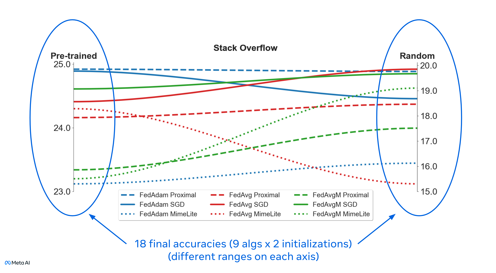

# Where to Begin? On the Impact of Pre-Training and Initialization in Federated Learning

* Authors: John Nguyen, Jianyu Wang, Kshitiz Malik, Maziar Sanjabi, Michael Rabbat
* Paper: [Where to Begin? On the Impact of Pre-Training and Initialization in Federated Learning](https://arxiv.org/abs/2206.15387)

An oft-cited challenge of federated learning is the presence of heterogeneity. *Data heterogeneity* refers to the fact that data from different clients may follow very different distributions. *System heterogeneity* refers to client devices having different system capabilities. A considerable number of federated optimization methods address this challenge. In the literature, empirical evaluations usually start federated training from random initialization. However, in many practical applications of federated learning, the server has access to proxy data for the training task that can be used to pre-train a model before starting federated training. Using four standard federated learning benchmark datasets, we empirically study the impact of starting from a pre-trained model in federated learning. Unsurprisingly, starting from a pre-trained model reduces the training time required to reach a target error rate and enables the training of more accurate models (up to 40\%) than is possible when starting from random initialization. Surprisingly, we also find that starting federated learning from a pre-trained initialization reduces the effect of both data and system heterogeneity. We recommend future work proposing and evaluating federated optimization methods to evaluate the performance when starting from random and pre-trained initializations. This study raises several questions for further work on understanding the role of heterogeneity in federated optimization.

<p align="center">
  
</p>

## Installation
We're using a fork of FLSim so please run the following command. 
```
cd FLSim
pip install -e .
```

## Data 
* To generate CIFAR-10 dirichlet with other values of alpha data split please use this [notebook](https://colab.research.google.com/drive/1GeQOB2VGaj4qPXpL4j2ojBiNKEQ3CAsB?usp=sharing)

* We provided the pre-partioned CIFAR-10 with alpha in {0.1, 10, inf}, FEMNIST and Stack Overflow in this [google drive](https://drive.google.com/drive/folders/1Bg6zlN3hEwrJYtBFuLhMt6AJ5jYdxB86?usp=sharing). 


## Results
To reproduce our results, run `cd benchmarks/` then 

### CIFAR-10
`python3 run_cifar10_dirichlet.py --config-file configs/cifar_config.json`

### FEMNIST 
`python3 run_femnist.py --config-file configs/femnist_config.json`

### Stack OverFlow
`python3 run_stackoverflow.py --config-file configs/stackoverflow_config.json`

## License
This code is released under CC BY-NC 4.0, as found in the [LICENSE](https://github.com/facebookresearch/where_to_begin/blob/main/LICENSE) file.

## Reference
Please consider to cite our paper if use this repo in your work.
```
@article{nguyen2022begin,
  title={Where to begin? exploring the impact of pre-training and initialization in federated learning},
  author={Nguyen, John and Malik, Kshitiz and Sanjabi, Maziar and Rabbat, Michael},
  journal={International Conference on Learning Representations},
  year={2023}
}
```